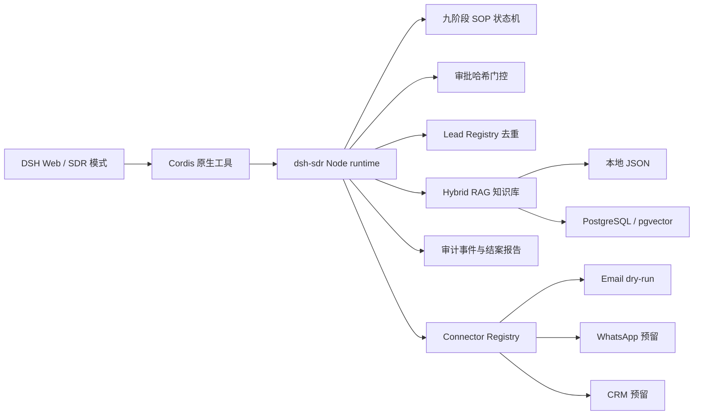

# DeepSeek Harness SDR Plugin

[](https://www.npmjs.com/package/@xuxchloris/dsh-sdr)
[](https://www.npmjs.com/package/@xuxchloris/dsh-sdr)
[](LICENSE)

DeepSeek Harness 的外贸获客 SDR 插件。安装后在 DSH Web 的模式菜单中选择「SDR 数字员工」，Agent 按九阶段销售流程工作：解析任务、开发客户、公司背调、评分、写开发信、人工审批、跟进计划、报价素材、结案。

阶段顺序由服务端状态机决定，模型不能跳阶段。开发信必须经人工批准才能进入后续流程。Email、WhatsApp、CRM 默认 dry-run，不会发出真实消息。

## 安装

要求 DeepSeek Harness `0.1.0-rc.6`、Node.js `20+`。

```powershell
dsh plugin --profile web add @xuxchloris/dsh-sdr
dsh web
```

重启 Web 后新建会话，在模式菜单选择「SDR 数字员工」。旧会话仍使用旧 preset，需要新建。

从源码安装：

```powershell
git clone https://github.com/Xuxchloris/deepseek-harness-sdr-plugin.git
cd deepseek-harness-sdr-plugin
dsh plugin --profile web add ".\packages\dsh-sdr"
dsh web
```

preset 写入 `$DSH_HOME/.agent-presets/sdr`；Windows 未设置 `DSH_HOME` 时是 `%USERPROFILE%\.dsh\.agent-presets\sdr`。安装器不会覆盖没有 `dsh-sdr` 管理标记的同名 preset。

## 使用

在 SDR 模式中输入任务，例如：

```text
开发 3 个美国户外用品客户
```

Agent 调用 `sdr_create_task` 创建任务，然后反复调用 `sdr_next_step` 推进，每次只完成一个阶段。

第 6 阶段时，`sdr_review_drafts` 列出开发信草稿，等人工选择。只要还有草稿没批，`sdr_continue_after_approval` 就拒绝放行。批准凭证绑定草稿内容哈希：草稿改过后，原来的批准自动失效，需要重新审批。

没有 DSH Web 时可以跑离线演示，合成数据，不需要凭证：

```powershell
npm.cmd test --prefix ".\packages\dsh-sdr"
node ".\scripts\demo_dsh_sdr.mjs"
```

## 架构



DSH 负责 Agent loop、工具调用和人机交互；插件负责任务状态、审批、去重、知识库和发送边界。模型没有 `send_email` 之类的通用发送工具可用。

## 工具

| 工具 | 作用 |
| --- | --- |
| `sdr_create_task` | 创建任务；相同请求幂等返回原任务 |
| `sdr_next_step` | 执行服务端决定的下一阶段 |
| `sdr_review_drafts` | 列出草稿，发起人工审批 |
| `sdr_continue_after_approval` | 校验批准后放行后续阶段 |
| `sdr_get_task` / `sdr_get_report` | 读取任务状态、结案报告 |
| `sdr_audit_log` | 回放工具调用、阶段和审批事件 |
| `sdr_knowledge_search` | 检索企业知识 |
| `sdr_knowledge_upsert` | 写入知识（需显式开启） |
| `sdr_knowledge_list` | 列出知识条目摘要 |
| `sdr_knowledge_evaluate` | 评测召回质量（Recall@K、MRR） |
| `sdr_connector_status` | 查看 connector 状态 |
| `sdr_configure_connector` | 写入非敏感 connector 配置（需显式开启） |

## 知识库

知识库存放产品、品牌、认证、报价政策、市场规则等资料，供开发信草稿和结案报告引用，引用记录来源和版本。默认实现是本地原子 JSON 文件，支持全文检索，可注入 embedding 和 reranker；生产环境可换成 PostgreSQL + pgvector，见 `lib/postgres-rag.js`。

默认只读。允许 Agent 写入用户确认过的知识时开启：

```powershell
$env:DSH_SDR_AGENT_KNOWLEDGE = '1'
```

密码、API key、token 不会进入知识库、工具参数或审计日志。

## 外部连接

Email、WhatsApp、CRM 都走 connector 接口，默认实现是 dry-run，`send()` 返回 `blocked-dry-run`。接真实渠道需要部署方注册自己的 connector 实现，审批流程不变。

允许 Agent 补充部署配置时开启 `DSH_SDR_AGENT_CONFIG=1`。Agent 只能写 host、port、provider、发件人和凭证引用名，写不了密码和 token 的值。`DSH_SDR_AGENT_LIVE_CONFIG=1` 只保存 live 配置，不会自动启用真实发送。

任务状态默认保存在 `%USERPROFILE%\.dsh\.dsh-sdr\state.json`，可用 `DSH_SDR_DATA_FILE` 改路径。JSON 写入先落临时文件再 rename，进程中断不会写坏状态。

## 项目结构

```text
packages/dsh-sdr/       DSH 插件 bundle（交付物）
  lib/domain.js         SOP 状态机、审批、去重和知识服务
  lib/rag.js            本地混合 RAG、reranker 和评测
  lib/postgres-rag.js   PostgreSQL/pgvector adapter
  lib/index.js          DSH 工具注册入口
  presets/sdr/          「SDR 数字员工」persona 和 preset
app/                    原 ai-sdr Python 业务代码，完整保留
scripts/                离线演示脚本
docs/                   迁移方案和验收记录
```

## 与原 ai-sdr 的关系

这个仓库的前身是 Python 项目 ai-sdr（`app/`：FastAPI、飞书机器人、Pydantic AI、旧 MCP 入口），代码完整保留，可独立运行。当前交付物是 `packages/dsh-sdr/`，用 Node.js 重新实现，运行时不依赖 Python 环境。取舍过程见 [docs/迁移方案.md](docs/迁移方案.md)。

## 限制

- 只验证过 DSH `0.1.0-rc.6`，其他版本未测。
- 默认 JSON 存储适合本地和单实例；多实例部署用 PostgreSQL adapter。
- 真实邮件、WhatsApp、CRM connector 不随包提供，只有接口和 dry-run 实现。
- 当前会话不支持 agent 交互提问时，审批请求会失败，任务冻结在原地，不会跳过审批继续跑。

## 开发与发布

```powershell
npm.cmd test --prefix ".\packages\dsh-sdr"
```

发布由 `.github/workflows/npm-publish.yml` 完成：推 `dsh-sdr-v*` 标签触发，先跑测试，再用 npm Trusted Publishing 发布，不需要长期 npm token。

## 许可证

MIT。仓库不含 `.env`、真实客户数据和 API key，示例数据均为合成。
