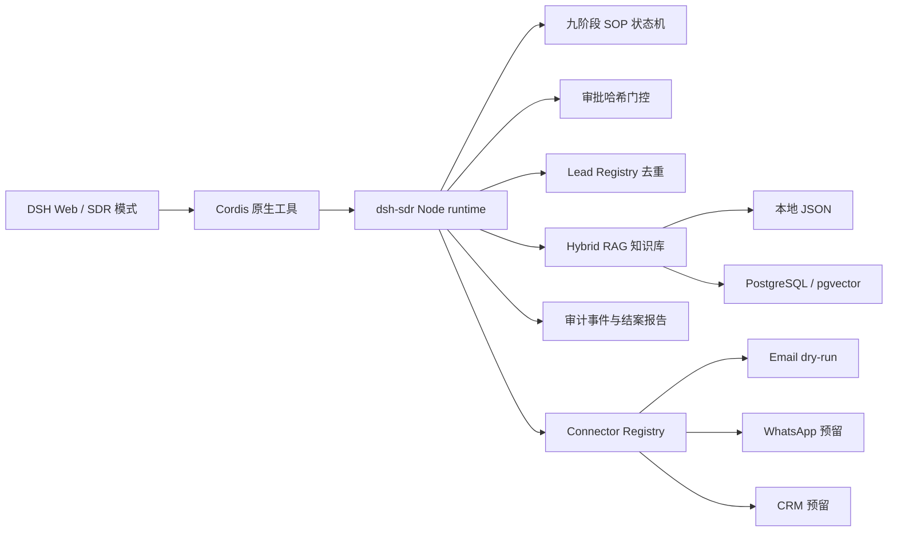

# DeepSeek Harness SDR Plugin

[](https://www.npmjs.com/package/@xuxchloris/dsh-sdr)
[](https://www.npmjs.com/package/@xuxchloris/dsh-sdr)
[](LICENSE)

面向 DeepSeek Harness `0.1.0-rc.6` 的外贸获客 SDR 数字员工插件。它把九阶段销售 SOP、持久化知识检索、客户去重、结构性人工审批和审计日志封装成可安装的 DSH 原生 Node.js bundle。

> English: An installable DeepSeek Harness plugin for an auditable foreign-trade SDR digital employee. It provides a nine-stage sales workflow, persistent knowledge retrieval, lead deduplication, structural human approval, and dry-run connectors.

当前公开包：[`@xuxchloris/dsh-sdr`](https://www.npmjs.com/package/@xuxchloris/dsh-sdr)  
源码：<https://github.com/Xuxchloris/deepseek-harness-sdr-plugin>

## 为什么是这个插件

- **流程可控**：服务端状态机决定下一阶段，模型不能跳阶段或调用任意发送工具。
- **审批是硬门槛**：开发信必须经过人工选择；审批凭证绑定草稿哈希，草稿变化后自动失效。
- **不会重复开发**：按 canonical domain、邮箱、电话和标准化公司名做跨活动去重，并对相同活动请求幂等。
- **知识可追溯**：产品、品牌、认证、政策和案例进入持久化知识库，草稿和结案报告保留来源与版本引用。
- **默认安全演示**：Email、WhatsApp、CRM 连接器默认 dry-run，没有凭证也能完整跑通流程。
- **可持续扩展**：DSH 负责 Agent loop 和交互，SDR 内核负责业务约束；未来可替换 PostgreSQL、向量库和外部渠道而不改 SOP 工具契约。

## 兼容性与状态

| 项目 | 当前状态 |
| --- | --- |
| DeepSeek Harness | `0.1.0-rc.6` 首个兼容目标 |
| Node.js | `20+` |
| 安装方式 | npm、GitHub 源码、本地目录 |
| 模式菜单 | 「SDR 数字员工」 |
| 默认数据 | 本地原子 JSON，支持恢复任务 |
| 外部发送 | 默认 dry-run；真实 connector 尚未随包启用 |
| 生产存储 | 可注入 PostgreSQL + pgvector adapter |

## 安装

### 从 npm 安装

```powershell
dsh plugin --profile web add @xuxchloris/dsh-sdr
dsh web
```

重启 Web 后新建会话，在模式菜单选择「SDR 数字员工」。如果已经安装过旧版本，再执行一次 `add` 后重启 `dsh web`；旧会话可能仍使用旧 preset。

### 从源码或本地目录安装

```powershell
git clone https://github.com/Xuxchloris/deepseek-harness-sdr-plugin.git
cd deepseek-harness-sdr-plugin
dsh plugin --profile web add ".\packages\dsh-sdr"
dsh web
```

Windows 本地开发也可以直接安装：

```powershell
dsh plugin --profile web add "E:\ai-sdr\packages\dsh-sdr"
```

rc.6 使用受管 preset 安装器。preset 默认写入 `$DSH_HOME/.agent-presets/sdr`；未设置 `DSH_HOME` 时，Windows 默认位置是 `%USERPROFILE%\\.dsh\\.agent-presets\\sdr`。安装器不会覆盖没有 `dsh-sdr` 管理标记的同名 preset。

插件是 DSH 原生 Node bundle，不需要启动 Python MCP 服务，也不占用固定业务端口。

## 五分钟验收

在「SDR 数字员工」模式中派单：

```text
开发 3 个美国户外用品客户
```

预期行为：

1. Agent 按任务解析、客户发现、公司背调、评分、开发信、人工审批、跟进计划、报价素材、结案九个阶段推进。
2. 到达第 6 阶段时，界面展示开发信草稿并等待人工选择。
3. 未全部批准时，`sdr_continue_after_approval` 必须失败，流程不能进入跟进、报价或结案。
4. 批准后继续运行，最终得到结构化结案报告和可回放审计日志。

无 DSH Web 时也可以运行离线内核演示：

```powershell
npm.cmd test --prefix ".\packages\dsh-sdr"
node ".\scripts\demo_dsh_sdr.mjs"
```

离线演示使用合成数据，不需要登录、外部 API 或真实客户资料。

## 架构



DSH 负责 Agent loop、工具调用和人机交互；`dsh-sdr` 负责任务状态、工具权限、审批、去重、知识和安全边界。模型不能指定任意 stage，也没有通用 `send` 工具可以绕过审批。

## SDR 工具

| 工具 | 用途 |
| --- | --- |
| `sdr_create_task` | 创建可恢复、可幂等的销售任务 |
| `sdr_next_step` | 执行服务端决定的下一 SOP 阶段 |
| `sdr_review_drafts` | 展示草稿并发起唯一的人工作审批入口 |
| `sdr_continue_after_approval` | 校验全部当前草稿哈希后结构性放行 |
| `sdr_get_task` / `sdr_get_report` | 读取任务状态和结构化结案报告 |
| `sdr_audit_log` | 回放工具调用、阶段、审批和结果事件 |
| `sdr_knowledge_search` | 检索有来源版本的企业知识 |
| `sdr_knowledge_upsert` | 在显式开关下沉淀用户确认的知识 |
| `sdr_knowledge_list` | 列出持久化知识条目摘要与版本 |
| `sdr_knowledge_evaluate` | 评测 Recall@K 和 MRR |
| `sdr_connector_status` | 查看 Email、WhatsApp、CRM 的安全状态 |
| `sdr_configure_connector` | 在部署策略允许时写入非敏感 connector 覆盖 |

## 持久化知识与 RAG

插件把记忆分为四层，避免把聊天内容直接当成企业事实：

```text
DSH 会话记忆     当前对话和短期上下文
SDR 任务状态     阶段、客户、草稿、审批、结案
企业知识库      产品、品牌、认证、政策、案例、市场资料
审计与来源      版本、更新时间、引用关系和变更记录
```

默认 adapter 使用原子 JSON 文件，支持分块、全文召回、可注入 embedding 的语义召回、混合排序、reranker 和来源版本。`PostgresKnowledgeRepository` 提供 PostgreSQL 全文检索与 pgvector 生产适配。`sdr_knowledge_evaluate` 可用人工标注查询集做上线前回归，输出 Recall@K 和 MRR。

如需让 Agent 沉淀经用户确认的新产品、认证或报价规则，部署时开启：

```powershell
$env:DSH_SDR_AGENT_KNOWLEDGE = '1'
```

密码、API key、token 和私钥不会进入知识库、工具参数或审计日志。

## 审批与外部连接

```text
生成草稿 -> 计算草稿哈希 -> 人工选择 -> 全部批准 -> 后续 SOP
```

当前 connector 全部是 dry-run。`DSH_SDR_AGENT_LIVE_CONFIG=1` 只允许保存 `mode=live` 配置，不会凭空启用真实发送；生产环境还需要部署方注册真实 Email、WhatsApp 或 CRM connector，并继续使用同一个审批门控。

部署前可注入非敏感基线；如需允许 Agent 在部署期间补充白名单配置，再显式开启 `DSH_SDR_AGENT_CONFIG=1`。Agent 只能填写 host、port、provider、发件人和凭证引用名，不能写入密码、token 或 API key 的值。

## 项目结构

```text
packages/dsh-sdr/       DSH 插件 bundle（主要交付物）
  lib/domain.js         SOP 状态机、审批、去重和知识服务
  lib/rag.js            本地混合 RAG、reranker 和评测
  lib/postgres-rag.js   PostgreSQL/pgvector adapter
  lib/index.js          DSH native tool 注册入口
  presets/sdr/          「SDR 数字员工」persona 和 preset
app/                    原 ai-sdr Python 业务代码，完整保留
scripts/                离线演示脚本
docs/                   迁移方案和验收记录
```

## 与原 ai-sdr 的关系

原项目经历了 Python SOP、Agent loop、工具门控和 RAG 的迭代；当前仓库的正式交付物是 `packages/dsh-sdr/`。原 `app/` Python 路径、FastAPI、飞书机器人和旧 MCP 入口全部保留，可独立运行，不是 DSH 插件的运行时依赖。历史 `export_skills/` 仅作为演进来源，不参与 bundle 安装。

## 当前限制

- 首个兼容目标是 DSH `0.1.0-rc.6`，其他版本需要重新验证 preset 和 Cordis API。
- 默认 JSON 存储适合本地和单实例；生产多实例应注入 PostgreSQL/pgvector。
- WhatsApp、CRM 和真实邮件 connector 目前提供接口和 dry-run 实现，不随包启用真实外发。
- 如果当前 Web 会话不支持 agent-owned 交互审批，任务会 fail-closed 安全冻结，不能用 prompt 绕过。

## 开发与发布

运行插件测试：

```powershell
npm.cmd test --prefix ".\packages\dsh-sdr"
```

维护者发布通过 `.github/workflows/npm-publish.yml` 的 GitHub Actions OIDC 和 npm Trusted Publishing 完成，只对 `dsh-sdr-v*` 标签触发。普通用户不需要配置 npm token。发布细节见 [packages/dsh-sdr/README.md](packages/dsh-sdr/README.md)。

## 许可证

MIT License。仓库不包含 `.env`、真实客户数据或 API key；示例数据均为合成数据。

相关链接：

- npm: <https://www.npmjs.com/package/@xuxchloris/dsh-sdr>
- DeepSeek Harness 文档: <https://deepseek-harness.github.io/deepseek-harness/en/develop/basic/>
